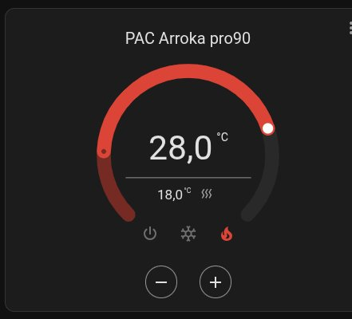
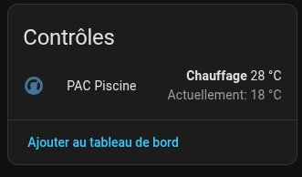
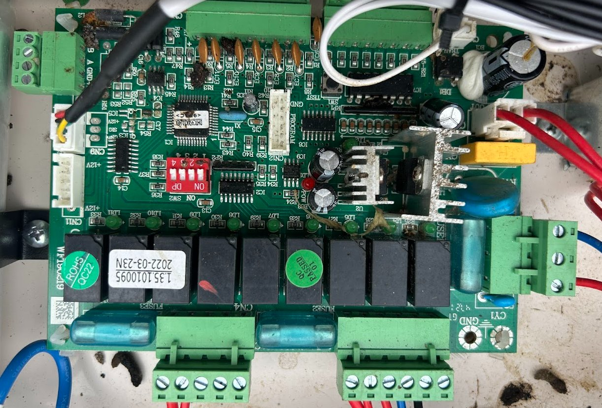

# 🏊 Arroka Pro 90 — Contrôle WiFi via ESP32 + RS485

Ajout du contrôle WiFi à une pompe à chaleur piscine **Arroka Pro 90** (ByPiscine, 2022) via un ESP32 connecté au bus RS485 de la carte mère, intégré dans **Home Assistant** via **ESPHome**.

> ✅ Testé sur carte mère ref. `1.35.1010095` datée `2022-03-23`  
> 📌 Probablement compatible avec toutes les PAC ByPiscine / Pool Comfort **avant 2023** (sans WiFi intégré)

---

## 🎯 Résultat

<p align="center">
  
  &nbsp;&nbsp;
  
</p>

Contrôle complet depuis Home Assistant :
- 🌡️ Température eau en temps réel
- 🌬️ Température air extérieur
- 🎯 Réglage de la consigne (15 à 32°C)
- 🔥 Mode Chauffage / ❄️ Mode Refroidissement
- ⏸️ ON / OFF

---

## ⚡ Installation rapide (sans compilation)

> Si vous avez exactement le même matériel, vous pouvez flasher directement sans compiler.

### 1. Flasher le firmware

1. Branchez l'ESP32 en USB à votre ordinateur
2. Ouvrez https://web.esphome.io dans Chrome/Edge
3. Cliquez **"Connect"** → sélectionnez le port USB
4. Cliquez **"Install"** → choisissez [`firmware/arroka-pac-factory.bin`](firmware/arroka-pac-factory.bin)
5. Attendez ~2 minutes

### 2. Configurer le WiFi

Après le flash, un réseau WiFi **"Arroka Fallback"** apparaît.  
Connectez-vous et entrez vos identifiants WiFi.

### 3. Ajouter dans Home Assistant

L'appareil est découvert automatiquement :  
**Paramètres → Appareils et services → ESPHome → Configurer**

---

## 🛒 Matériel nécessaire

| Composant | Référence | Prix |
|-----------|-----------|------|
| Microcontrôleur | ESP32-WROOM-32 (AZ-Delivery DevKit v4) | ~8€ |
| Convertisseur RS485 | Module MAX485 | ~1€ |
| Alimentation | Chargeur USB 5V/**1A minimum** | ~5€ |
| Câble | Micro-USB **data+charge** | ~3€ |
| Fils | Dupont M/F | ~2€ |

**Total : ~19€**

---

## 🔌 Câblage

### Connecteur CN8 sur la carte mère

<p align="center">
  
</p>

> Le connecteur **CN8** est visible en bas à droite de la carte mère (ref. `1.35.1010095`).  
> Il expose 4 bornes : **B, A, GND, +12V** (de gauche à droite).

### Schéma de connexion

```
PAC CN8          MAX485              ESP32 AZ-Delivery
──────────────────────────────────────────────────────
A           ───► A
B           ───► B
GND         ───► GND ◄────────────── GND
+12V             ⛔ NE PAS BRANCHER

                 VCC ◄────────────── U5  (5V — broche en haut à droite)
                 GND ◄────────────── GND
                 DI  ◄────────────── GPIO17 (TX2)
                 RO  ─────────────►  GPIO16 (RX2)
                 DE+RE ◄──────────── GPIO4
```

> ⚠️ **IMPORTANT** : Ne **jamais** brancher le +12V de la PAC sur le MAX485.  
> Le MAX485 est alimenté en **5V** uniquement depuis la broche `U5` de l'ESP32.  
> ⚠️ Coupez l'alimentation de la PAC avant de brancher les fils sur CN8.

---

## 📡 Protocole RS485 décodé

> Section technique pour comprendre comment fonctionne l'intégration.

### Paramètres de communication

| Paramètre | Valeur |
|-----------|--------|
| Baudrate | **9600 bps** |
| Format | 8N1 (8 bits, pas de parité, 1 stop bit) |
| Longueur trame | **13 octets fixes** |

### Structure d'une trame

```
[00] [01] [02] [03] [04] [05] [06] [07] [08] [09] [10] [11] [12]
 ID  Teau Cons  ?    ?    ?    ?   FLAG  Teau  ?    ?   0x7F CRC
```

| Byte | Trame | Exemple | Signification |
|------|-------|---------|---------------|
| [00] | toutes | `CC/CD/DD` | Identifiant de trame |
| [01] | DD | `0x11` = 17 | **Température eau mesurée** (°C) |
| [02] | CC/CD | `0x1C` = 28 | **Consigne température** (°C) |
| [05] | DD | `0x0F` = 15 | **Température air extérieur** (°C) |
| [07] | CC/CD | voir ci-dessous | **FLAG : ON/OFF + MODE** |
| [08] | DD | `0x00`=arrêt | **État compresseur** |
| [11] | toutes | `0x7F` | Marqueur fin (fixe) |
| [12] | toutes | calculé | **CRC** |

### Byte[07] — FLAG mode

```
0x2C  →  PAC OFF + Mode CHAUFFAGE
0x6C  →  PAC ON  + Mode CHAUFFAGE
0x0C  →  PAC OFF + Mode REFROIDISSEMENT
0x4C  →  PAC ON  + Mode REFROIDISSEMENT

Bit 6 (0x40) : ON=1 / OFF=0
Bit 5 (0x20) : HEAT=1 / COOL=0
```

### Calcul CRC

```cpp
uint8_t x = 0;
for (int i = 0; i < 12; i++) x ^= frame[i];
frame[12] = x ^ 0xBD;  // trame CD (commande)
```

### Envoi d'une commande

```
1. Attendre réception trame CC
2. Copier la trame CC dans un buffer
3. frame[0] = 0xCD
4. frame[2] = consigne
5. frame[7] = flag (ON/OFF + mode)
6. Recalculer CRC
7. DE/RE = HIGH → envoyer 13 bytes → DE/RE = LOW
```

---

## ⚙️ Installation depuis les sources

### Prérequis
- Home Assistant avec l'addon **ESPHome**
- Addon **File Editor**

### Structure des fichiers

```
/config/esphome/
├── arroka-pac.yaml
└── components/
    └── arroka/
        ├── __init__.py        ← fichier vide obligatoire
        ├── climate.py         ← composant Python ESPHome
        └── arroka_climate.h   ← code C++ de contrôle RS485
```

### Étapes

1. Copiez les fichiers du dossier [`esphome/`](esphome/) dans `/config/esphome/` via File Editor
2. Dans `arroka-pac.yaml`, remplacez `VotreSSID` et `VotreMotDePasse`
3. Dans ESPHome, **Install → Manual download → Factory format**
4. Flashez via https://web.esphome.io

---

## 🔧 Sketch Arduino de diagnostic

Le fichier [`arduino/arroka_debug/arroka_debug.ino`](arduino/arroka_debug/arroka_debug.ino) permet de tester sans ESPHome.

Ouvrez le moniteur série (**9600 baud, Both NL & CR**) et tapez :

| Commande | Action |
|----------|--------|
| `STATUS` | Affiche température, consigne, mode |
| `ON` | Allume la PAC |
| `OFF` | Éteint la PAC |
| `HEAT` | Mode chauffage |
| `COOL` | Mode refroidissement |
| `SET 28` | Consigne à 28°C (15–32) |

---

## ❓ FAQ

**Q : Compatible avec d'autres modèles ?**  
R : Potentiellement compatible avec toutes les PAC ByPiscine / Pool Comfort **avant 2023**. Les modèles post-2023 ont le WiFi intégré de série.

**Q : Risque de casser la PAC ?**  
R : L'ESP32 est en écoute passive. Il n'injecte des trames que ponctuellement, en copiant exactement le format du boîtier physique. Le boîtier continue de fonctionner normalement.

**Q : Le boîtier physique continue de fonctionner ?**  
R : Oui, les deux contrôles coexistent. Le dernier à envoyer une commande est prioritaire.

**Q : Quelle alimentation ?**  
R : Un chargeur USB **5V/1A** suffit (chargeur de téléphone ancien). Le câble doit être **data+charge**.

---

## 📜 Licence

MIT — Libre d'utilisation, modification et redistribution.

---

## 🤝 Contribution

Les PR sont bienvenues ! En particulier :
- Tests sur d'autres modèles ByPiscine
- Intégration Jeedom, Domoticz...
- Photos de câblage

---

*Projet réalisé par reverse engineering du protocole RS485 propriétaire.*  
*Aucune affiliation avec ByPiscine ou Arroka.*
